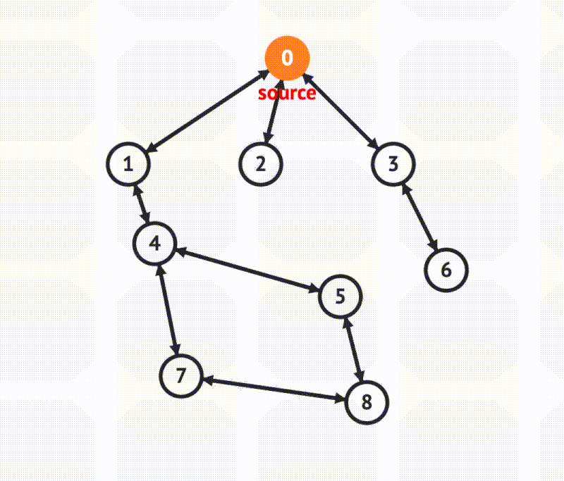

# c-sparse-matrix-engine



A 2D sparse matrix engine implemented as a graph data structure over a fixed grid.
The code stores only existing nodes in linked neighbor lists, avoiding a dense matrix
representation of empty cells.

## Technical Overview

### Sparse Graph Representation

- The engine uses two parallel arrays of `GraphNode` structures: `V` for vertical
  indexing by `y` and `H` for horizontal indexing by `x`.
- Each `GraphNode` contains a pointer to a linked list of `ArrayNode` neighbors.
- Horizontal neighbor lists are sorted by `y` and linked with `north`/`south`.
- Vertical neighbor lists are sorted by `x` and linked with `west`/`east`.
- Each existing coordinate `(x,y)` is represented by a single `ArrayNode` that is
  simultaneously part of both a horizontal and a vertical list.

### Insertion and Deletion

- `insert_node` checks the horizontal list of `H[x]` for duplicates, then inserts a
  new node into both `H[x]` and `V[y]` lists.
- Horizontal insertion maintains sorted order by `y`, while vertical insertion
  maintains sorted order by `x`.
- When `FLAG == 1`, the graph is treated as undirected, and the symmetric node
  `(y,x)` is also inserted.
- `delete_node` finds the target via horizontal or vertical traversal, removes it
  from both lists, and frees memory.
- Symmetric deletion also removes `(y,x)` when the graph is undirected.

### Breadth-First Search (BFS)

- BFS is implemented over the sparse graph using an explicit queue of `GraphNode`
  pointers.
- Before traversal, all `GraphNode` metadata is reset: `color='w'`, `distance=-1`,
  `predecessor=-1`.
- The source node is enqueued and discovered first with `color='g'` and distance 0.
- For each dequeued node, the algorithm iterates its horizontal neighbor list using
  the `east` pointer.
- Undiscovered neighbors are marked as discovered, assigned a distance, and
  enqueued for later processing.
- The edge from the current node to the neighbor is flagged as part of the
  spanning tree by setting `is_in_spanning_tree = true` on both `(x,y)` and its
  symmetric counterpart `(y,x)` when present.
- After BFS completion, the horizontal array `H` is synchronized with the state
  from `V` so both views reflect the same traversal metadata.

### Cycle Detection

- Cycle detection uses BFS predecessor paths and the spanning tree markers.
- `edges_not_in_spanning_tree` scans all discovered nodes and prints edges whose
  `is_in_spanning_tree` flag remains false.
- `cycles` reconstructs a cycle for each such non-tree edge `(x,y)` by tracing
  the predecessor chain from `x` and `y` back to the BFS root.
- The lowest common ancestor (LCA) is found by comparing the two ancestor paths
  from `x` and `y` until they diverge.
- The resulting cycle is printed as a path from `x` to the common ancestor and
  from the common ancestor back to `y`, closing the loop through `x`.

## Project Structure

```
project/
├── CMakeLists.txt
├── include/
│   ├── common.h
│   ├── input.h
│   ├── graph_operations.h
│   ├── bfs.h
│   └── cycles.h
└── src/
    ├── main.c
    ├── input.c
    ├── graph_operations.c
    ├── bfs.c
    └── cycles.c
```

## Build

Requires CMake and a C compiler.

```bash
cmake -S . -B build
cmake --build build --config Release
```

## Run

```bash
./build/graph_program
```

On Windows with a single-configuration generator, the executable may be located at:

```bash
build\graph_program.exe
```

## Example Output

When running BFS on the sample graph with source `0`, the program prints:

```text
BFS Results:
Node (0): Color: b, Distance: 0, Predecessor: None
Node (1): Color: b, Distance: 1, Predecessor: 0
Node (2): Color: b, Distance: 1, Predecessor: 0
Node (3): Color: b, Distance: 1, Predecessor: 0
Node (4): Color: b, Distance: 2, Predecessor: 1
Node (5): Color: b, Distance: 3, Predecessor: 4
Node (6): Color: b, Distance: 2, Predecessor: 3
Node (7): Color: b, Distance: 3, Predecessor: 4
Node (8): Color: b, Distance: 4, Predecessor: 5
```

```text
CYCLES

Source : 0

Edges indicating cycles in the graph:
(8, 7)
(7, 8)

Cycle involving edge (8, 7): 8-5-4-7-8
Cycle involving edge (7, 8): 7-4-5-8-7
```
